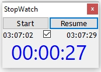
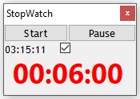

# Stopwatch

Stopwatch GUI which stays on top of all windows & starts as soon as application is invoked.

The stopwatch can paused, resumed & restarted.

The stopwatch will give visible & audio notification every 2 minutes (this duration can be changed in the code). 

The audio notification can be muted using the checkbox

## What does it do
 This is the overview of the screen components
 
  
  
## Screenshots of Stopwatch
| With Sound on | With Sound off | Paused | Visible Notification |
| -------- |  ------- | -------- |  ------- |
|  |   |   |  

# Installation Guide

### Pre-requisites & Setup
You need to  have [Autohotkey](http://www.autohotkey.com) installed. Download the .ahk file & resoures/stopwatch.ico in local folder. 

Double click on .ahk file to execute.

## Future Enhancements

Make the notification duration configurable. 
