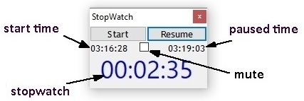
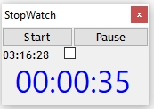
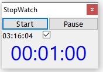

# Stopwatch
Stopwatch GUI which stays on top of all windows & starts as soon as application is invoked.
The timer can  paused/resumed.
The stopwatch will give visible & audio notification every 2 minutes (can be changed in the code). 
The audio notification can be disable using the checkbox. 

## What does it do
 This is the overview of the screen components
 
  
  
## Screenshots of Stopwatch
| With Sound on | With Sound off |
| -------- |  ------- |
|  |  

# Installation Guide

### Pre-requisites & Setup
You need to  have [Autohotkey](http://www.autohotkey.com) installed. Download the .ahk file & resoures/stopwatch.ico in local folder. 
Double click on .ahk file to execute.

## Troubleshooting

 As this application uses windows SCHTASKS.EXE to schedule tasks, you can use TASKSCHD.MSC to see logs if there are errors.
 The ini file includes logs of past excecutions for tracking. This can be used to troubleshoot.

## Future Enhancements

The application currently allows setting up just 1 future event at a time. This will be enhanced in later versions.
